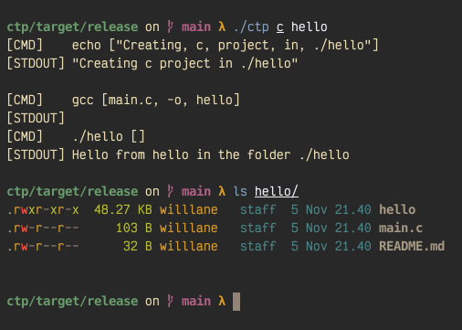

# Create That Project




[Config Example](./.ctp.toml.example)

### Install

```console
$ cargo install ctp
```

### Basic Info

In any file or even in the commands sections of your config file you can place {{\_\_NAME\_\_}} and/or {{\_\_OUT\_\_}}. Both of these will be replaced by their corresponding definitions that you pass in, hence dynamic.

{{\_\_NAME\_\_}} corresponds to the project name you passed into `ctp`

{{\_\_OUT\_\_}} corresponds to the project output directory you passed into `ctp` (defaults to the project name)

See [here](https://github.com/willdoescode/ctp/blob/main/proj-example/main.c) for why this is useful.

### Basic setup

Create `~/.ctp.toml` and populate with the following:

```toml
[templates]

[commands-before]

[commands-after]
```

Next, add the absolute path to a language template under `templates`

```toml
[templates]
c = "<path to c template>"
```

Finally, add whatever commands you would like to run like so:

```toml
[commands-before]
c = ["echo \"Creating project called {{_NAME__}} in directory {{__OUT__}}\""]

[commands-after]
c = ["gcc -o {{__NAME__}} {{__NAME__}}.c", "./{{__NAME__}}"]
```
